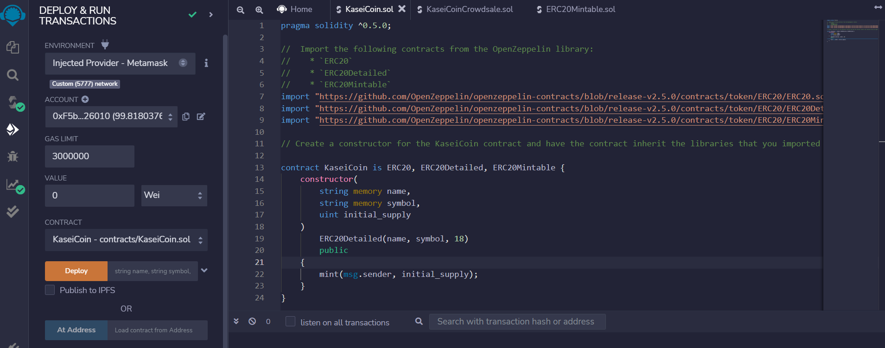
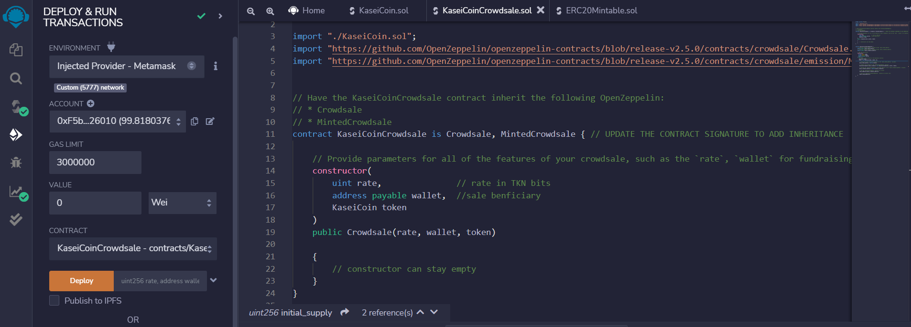

# M21-KaseiCoin 
Minting tokens for a CrowdSale  

 

*"Leading a project for a monetary system to develop a new cryptocurrency called KaseiCoin for a new Mars colony."* 


## Background 

After waiting for years and passing several tests, being selected by the Martian Aerospace Agency a new monetary system needs to be implemented for the first human colony on Mars. As a prominent fintech professional, I was chosen to lead a project to develop a monetary system for the new Mars colony. The decision is made to base this new monetary system on blockchain technology, and to define a new cryptocurrency called KaseiCoin. (“Kasei” means “Mars” in Japanese.)

KaseiCoin will be a fungible token that is ERC-20 compliant. The crowdsale contract created will manage the entire crowdsale process, allowing users to send ether to the contract and in return receive KAI, or KaseiCoin tokens. The contract will mint the tokens automatically and distribute them to buyers in one transaction. It will allow people who are moving to Mars to convert their earthling money to KaseiCoin.

---
#
## Evaluation Evidence

In the completed Solidity KaseiCoin Crowdsale smart contract a folder named `Evaluation_Evidence` contains images. These images are confirms of performance in a real-world, pre-production test of a KaseiCoin crowdsale. The transactions are designed to test the `KaseiCoin.sol`, `KaseiCoinCrowdsale.sol` and `KaseiCoinCrowdsaleDeployer` functionality in the JavaScript VM, as expected. In order to do so, deployment of the crowdsale is to a local blockchain using Remix, MetaMask, and Ganache.

After deploying the contract, it’s time to test its functionality! After each step, capture a screenshot of the execution, and then save it in a folder named `Evaluation_Evidence`. 

To interact with your compiled & deployed smart contract, complete the following steps. 
 

1. Create & compile the `KaseiCoin.sol` contract using compiler version 0.5.5; take a screenshot of the successful compilation of the contract, and add it to the Evaluation_Evidence section: 

    

2. Create, define & compile the `KaseiCoinCrowdsale.sol` contract inheriting OpenZeppelin contracts `Crowdsale` & `MintedCrowdsale`; check for any errors and debug as needed; compile the contract using compiler version 0.5.5; take a screenshot of the successful compilation of the contract, and add it to the Evaluation_Evidence section. 

    

3. Create the `KaseiCoinCrowdsaleDeployer` and add the `KaseiCoin` and `KaseiCoinCrowdsale`  contract addresses; add the `name`, `symbol`, and `wallet` parameters to the `KaseiCoinCrowdsaleDeployer`; renounce its minter role; compile the contract using compiler version 0.5.5; check for any errors and debug as needed; take a screenshot of the successful compilation of the contract, and add it to the Evaluation_Evidence section: 

    

4. Deploy the Crowdsale to a Local Blockchain

- Deployment of the contract to a local blockchain with Remix, MetaMask, and Ganache.: 
    

- Use test accounts to buy new tokens from the crowdsale and check the balances associated with the test accounts.:  
     

- After purchasing tokens with test accounts, view the total supply of minted tokens and the amount of wei raised by the crowdsale.:
     


5. Optional: Extend the Crowdsale Contract by Using OpenZeppelin. extend the crowdsale contract to enhance its functionality. To do so, you will use the following OpenZeppelin contracts:  

- `CappedCrowdsale`: This contract allows you to cap the total amount of ether that may be raised during your crowdsale.:

     

- `TimedCrowdsale`: This contract allows you to set a time limit for your crowdsale by adding an opening time and a closing time: 

    

- `RefundablePostDeliveryCrowdsale`: Every time you launch a crowdsale, you set a goal amount of ether to raise. If the goal is not reached, it is common practice to refund your investors. This contract adds this capability to a crowdsale: 
 
     


---
#
## Technologies

The software program was built using 'Remix 0.25.1' IDE in a web app. The Remix IDE is an open-source application for developing, deploying, and administering smart contracts that run in Ethereum-based blockchains development environment. 

The programming language was developed in 'Solidity 0.5.0' to create a smart contract and code that works on the Ethereum blockchain. The OpenZeppelin library provides a variety of contracts that are related to the ERC-20 token standard. The `ERC-20` standard defines some mandatory functions for a fungible-token contract and provides critical functionality for any `ERC-20` token smart contract. The `ERC20` contract uses the SafeMath library, and the ERC20 `_transfer` function is coded to prevent integer underflow error. 

Using 'Granache 2.5.4' app allows a quick setup of a local blockchain in a development environment. 'MetaMask 10.18.0' is a is a digital wallet for the digital currency blockchain. Together they operates in an isolated decentralized environment mimicking the consensus engine of the Ethereum blockchain to perform a `KaseiCoinCrowdsale` to mint coins for an ICO. 
 

---

## Installation Guide

The Remix IDE is an open source application for developing, deploying, and administering smart contracts that run in Ethereum-based blockchains. First navigate to use the web version of this IDE, you don’t need to install any software for this module. Open your browser to the [Remix-Docs website](https://remix-ide.readthedocs.io/en/latest/) or use the links below. The OpenZeppelin contract library `ERC20`; `ERC20Detailed`; `Crowdsale` and `MintedCrowdsale` are from the [OpenZeppelin documentationImport](https://github.com/OpenZeppelin/openzeppelin-contracts).


1. [Remix Online IDE](https://remix.ethereum.org) 
* Supported browsers: Firefox, Chrome, Brave. We do not support Remix’s use on tablets or mobile devices. 

2. [Remix Desktop IDE](https://github.com/ethereum/remix-desktop/releases) 

3. Follow the instructions on the [MetaMask Download page](https://metamask.io/download) to install MetaMask digital wallet in your web browser: 

Import to inherit the OpenZeppelin the `ERC20`; `ERC20Detailed`; `Crowdsale` and `MintedCrowdsale` contracts in the appropiate program applications:
```
import "https://github.com/OpenZeppelin/openzeppelin-contracts/blob/release-v2.5.0/contracts/token/ERC20/ERC20.sol";
import "https://github.com/OpenZeppelin/openzeppelin-contracts/blob/release-v2.5.0/contracts/token/ERC20/ERC20Detailed.sol"; 
import "https://github.com/OpenZeppelin/openzeppelin-contracts/blob/release-v2.5.0/contracts/token/ERC20/ERC20Mintable.sol"; 
import "./ArcadeTokenMintable.sol";
import "https://github.com/OpenZeppelin/openzeppelin-contracts/blob/release-v2.5.0/contracts/crowdsale/Crowdsale.sol";
import "https://github.com/OpenZeppelin/openzeppelin-contracts/blob/release-v2.5.0/contracts/crowdsale/emission/MintedCrowdsale.sol";
remix 
```


---

## Usage

This application is deployed and run for smart contract transactions to deposit and withdraw `eth` between user accounts in the EthereumVM.  It is launched from the Remix 0.25.1 using Solidity language for the **.sol** file to build the ` joint_savings.sol`. The 'Remix' GUI on the left side of the web page utilizes the program code to run the Smartcontracts Ethereum blockchain transactions. It is deployed in the Remix VM(London) JavaScript Environment utilizing the ‘Solidity’ compiler and tools. 
The user of the program application operates through the Remix IDE website that provides functionality to create an EthereumVM for blockchain transactions and perform the following:  

Once the program code runs it is compiled, deployed and evaluated for approval, and `KaseiCoinCrowdsale` will hold an ICO to mint digital coins for the Mars colony economy.
Complete the following steps to interact with compiling, deploying and holding a `KaseiCoinCrowdsale` ICO and mint digital coins for the Mars colony: 

### 1. Compile and Deploy Your Contract in ReMix. 

1.	In the Remix IDE, navigate to the “Deploy & Run Transactions” pane, and then make sure that "Injected Provider- Metamask" wallet is selected for the environment. 
- On the far left select 'Solidity'compiler; once compiled, the code runs in the **Ethereum Virtual Machine (EVM)**.

2.	Click the Deploy button to deploy your smart contract, and then confirm that it successfully deployed.
- The terminal can be used to check transactions details and start debugging. 

### 2. Interact with Your Deployed Smart Contract. 

1.	Use the setAccounts function to define the authorized Ethereum address that will be able to withdraw funds from your contract. 

- create new, dummy addresses on the [Vanity-ETH](https://vanity-eth.tk/) website, which includes an Ethereum vanity address generator. 

2.	Test the deposit functionality of the smart contract by sending selected amounts of `ether`. After each transaction, use the `contractBalance` function to verify that the funds were added to your contract: 

- Select 3 different deposit transaction amounts totaling more than 16 `ether` for withdrawals. 

- Reminder that `ether` is counted in `wei` in the contract accounts. (use the website [Ethereum Unit Converter](https://eth-converter.com/) to do the conversion.) 

3.	Once you’ve successfully deposited funds into your contract, test the contract’s withdrawal functionality by withdrawing 5 ether into accountOne and 10 ether into accountTwo. After each transaction, use the `contractBalance` function to verify that the funds were withdrawn from your contract. Also, use the `lastToWithdraw` and `lastWithdrawAmount` functions to verify that the address and amount were correct.


```
Solidity 

KaseiCoin.sol
KaseiCoinCrowdsale.sol
```
 
---

## Contributors

*Provided to you by digi-Borg FinTek*, 
Dana Hayes: nydane1@gmail.com


---

## License  

Columbia U. Engineering 
--
[BSD 2-Clause LicenseCopyright (c) 2022, digi-Borg
All rights reserved.](/LICENSE)
